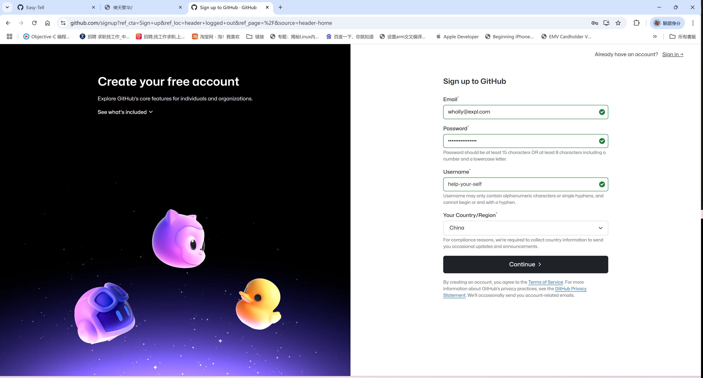
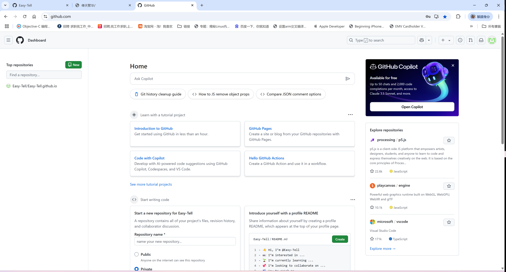
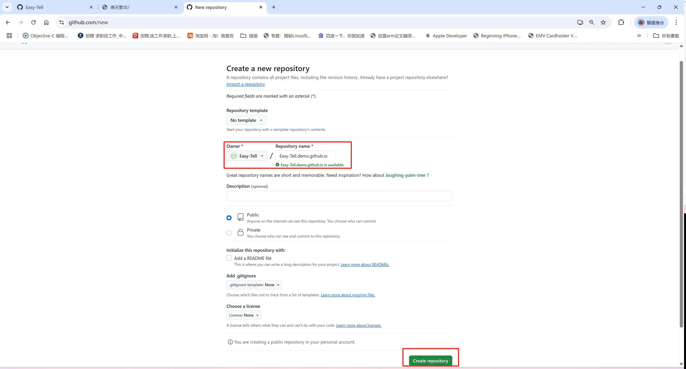
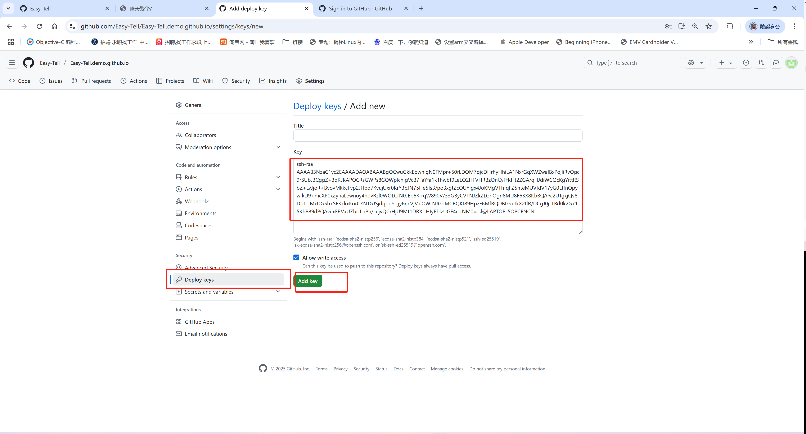

## Create github account

官网传送门：[https://github.com/](https://github.com/)

点击**Sign up** 注册新账号

填入一系列信息

注册完成后登录github

创建blog仓库

点击**New**按钮新建仓库如下输入你的个性化名字然后点击**Create repository**完成仓库创建

配置 **deploy keys**方便后期更新维护 **Settings → Deploy keys**

